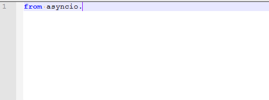
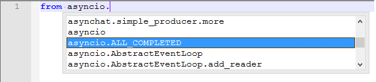

# python3-notepad-intellisense
better autocompletion for python 3.6 in notepad++

## Description

This project aims to enhance Notepad++ with advanced autocompletion for Python 3.
Why?
If you work on your laptop while without power supply, you notice that popular IDE's drain too much energy.
In contrast, Notepad++ consumption is quite modest compared to any IDE.

Tested on Notepad++ 7.5.6 32 bit.

## Installation
* close all instances of Notepad Plus Plus (NPP)
* backup original python.xml in %NPP_FOLDER%\plugins\APIs
* copy new python.xml into %NPP_FOLDER%\plugins\APIs

## Results:
The new functions / modules / classes definition is about 3.5M long compared to standard 65K definition.
### Before:

### After:

